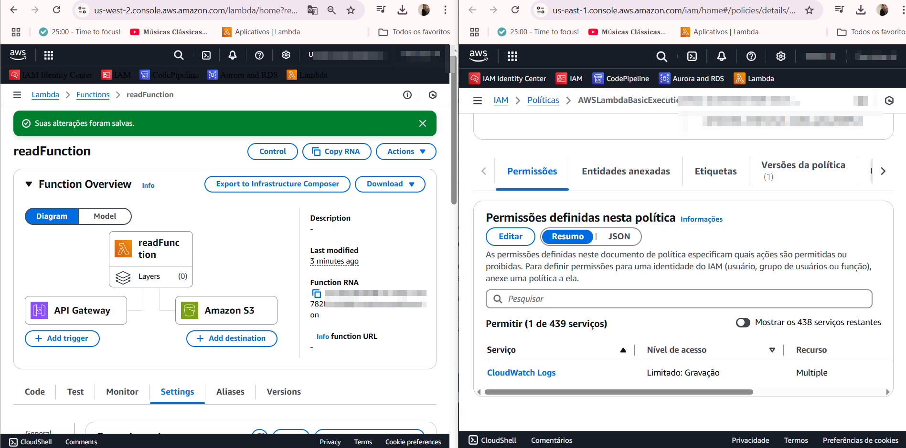
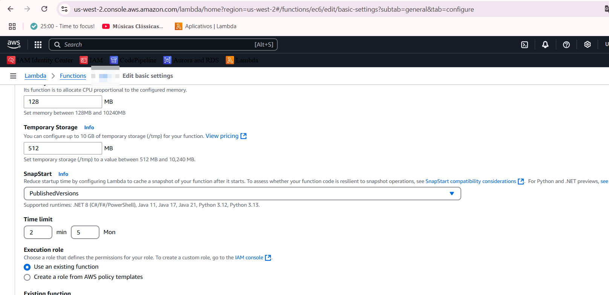

# serverless-init

[](/#/)

 


https://awspolicygen.s3.amazonaws.com/policygen.html

if UPPER CASE replace  
````
{
    "Version": "2012-10-17",
    "Id": "Reads3AllowPolicy",
    "Statement": [
        {
            "Sid": "Reads3",
            "Effect": "Allow",
            "Principal": {
                "AWS": "arn:aws:iam::ACCOUNT:user/USER"
            },
            "Action": [
                "s3:GetObject",
                "s3:GetBucketLocation",
                "s3:ListBucket"
            ],
            "Resource": [
                "arn:aws:s3:::s3-name-bucket1/*",
                "arn:aws:s3:::s3-name-bucket1"
            ]
        }
    ]
}
````
Source: https://docs.aws.amazon.com/AmazonS3/latest/userguide/access-policy-language-overview.html


````
{
    "Version": "2012-10-17",
    "Id": "CreateS3AllowPolicy",
    "Statement": [
        {
            "Sid": "createS3",
            "Effect": "Allow",
            "Principal": {
                "AWS": "arn:aws:iam::ACCOUNT:user/USER"
            },
            "Action": [
                "s3:CreateBucket",
                "s3:PutBucketAcl",
                "s3:PutObject"
            ],
            "Resource": [
                "arn:aws:s3:::s3-name-bucket1/*",
                "arn:aws:s3:::s3-name-bucket1"
            ]
        }
    ]
}
````
Source: https://docs.aws.amazon.com/AmazonS3/latest/userguide/using-with-s3-policy-actions.html

 

